# PushPredict Architecture Diagrams

This document contains Mermaid diagrams that visualize the architecture and flows of the PushPredict universal cross-chain prediction market platform with Push UI Kit integration.

## 1. System Architecture Overview (Updated with Push UI Kit)

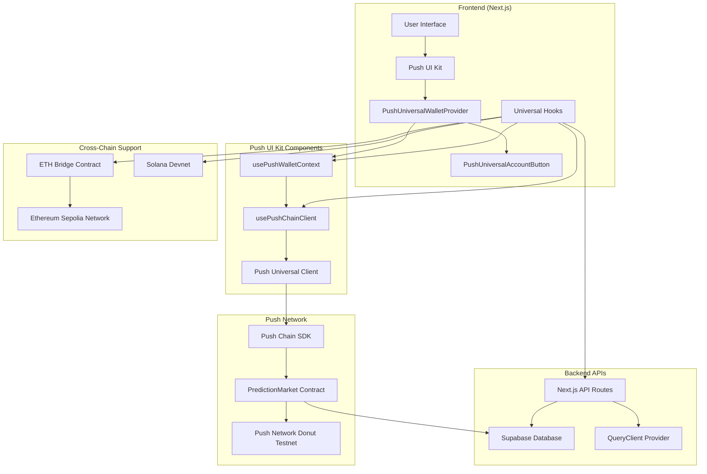

## 2. Push UI Kit Wallet Connection Flow

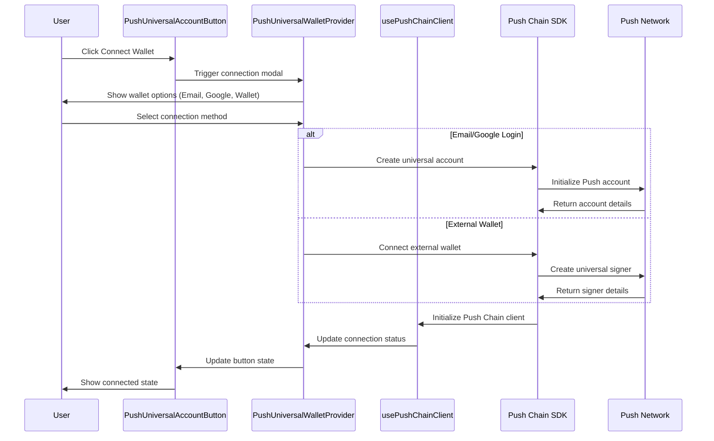

## 3. Push UI Kit Transaction Flow

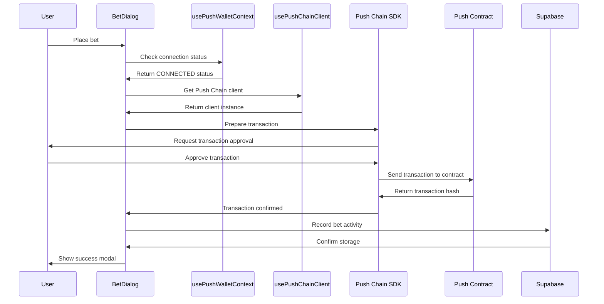

## 4. Database Schema Relationships

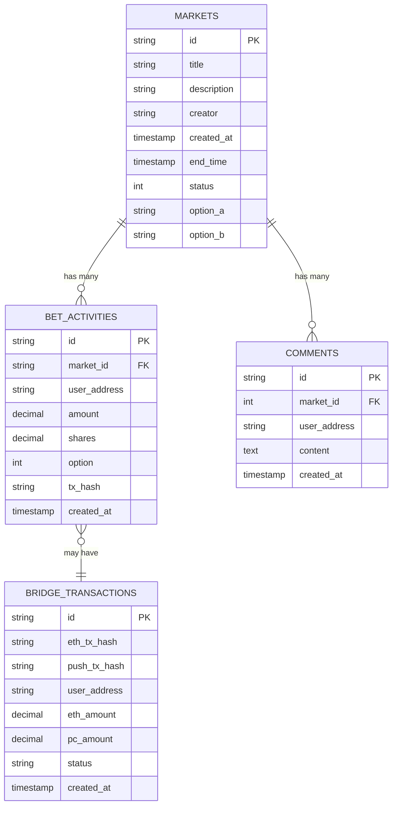

## 5. Push UI Kit Universal Connection Flow

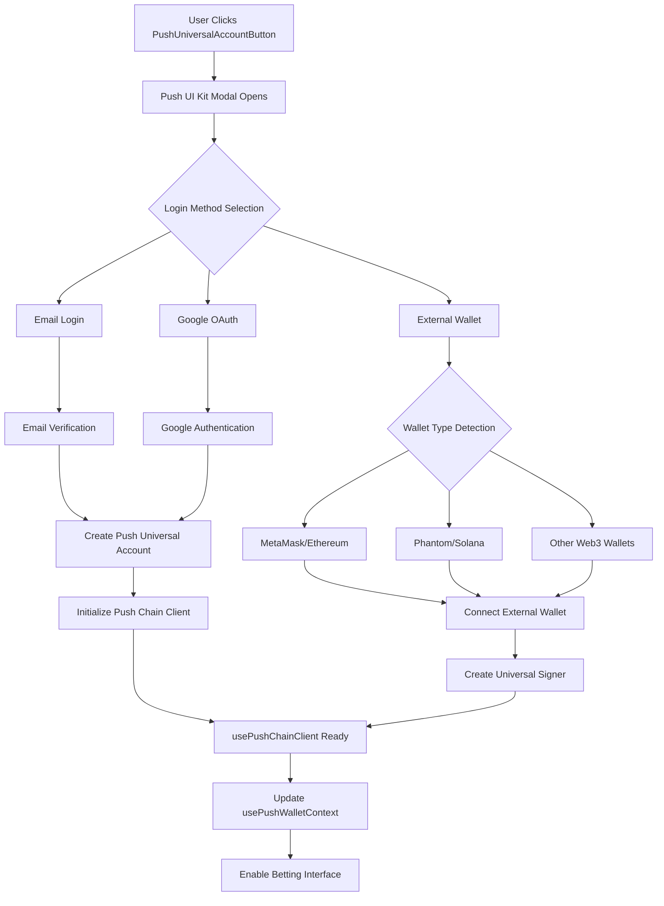

## 6. Market Resolution Process

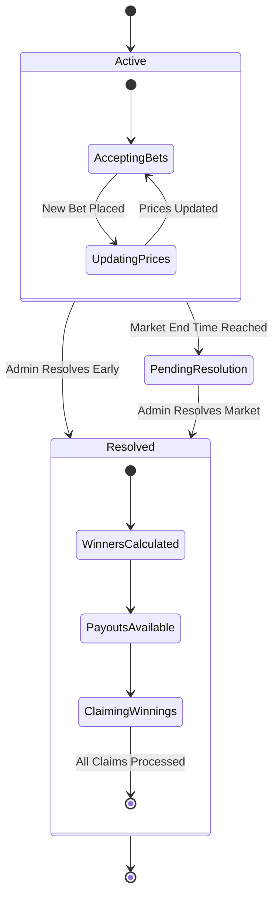

## 7. Cross-Chain Transaction Verification

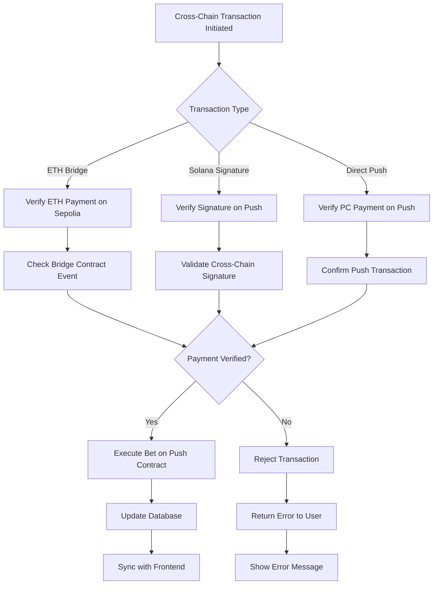

## 8. Push UI Kit Hook System Architecture

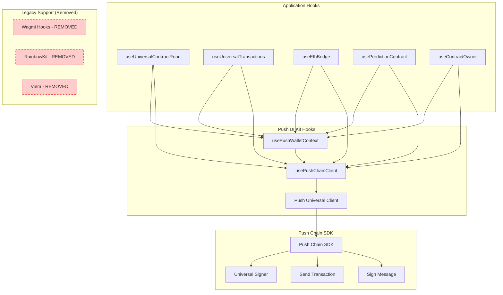

## 9. Real-Time Data Synchronization

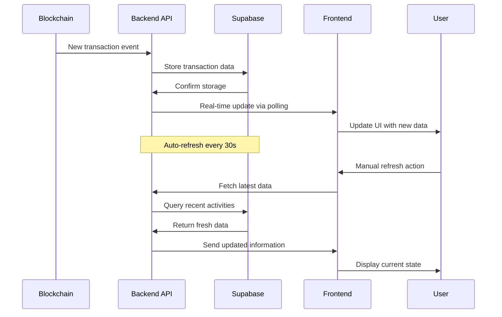

## 10. Security & Verification Flow

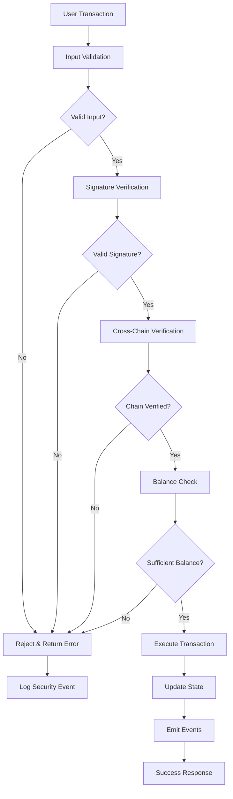

## 11. Pyth Network Price Feed Integration

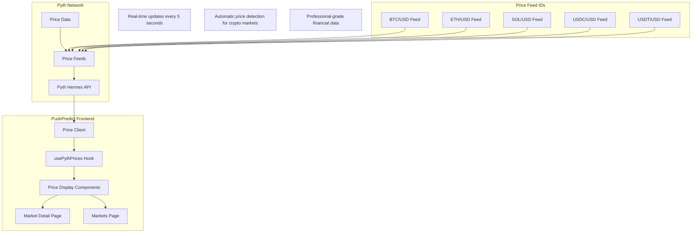

## 12. Live Price Display Flow

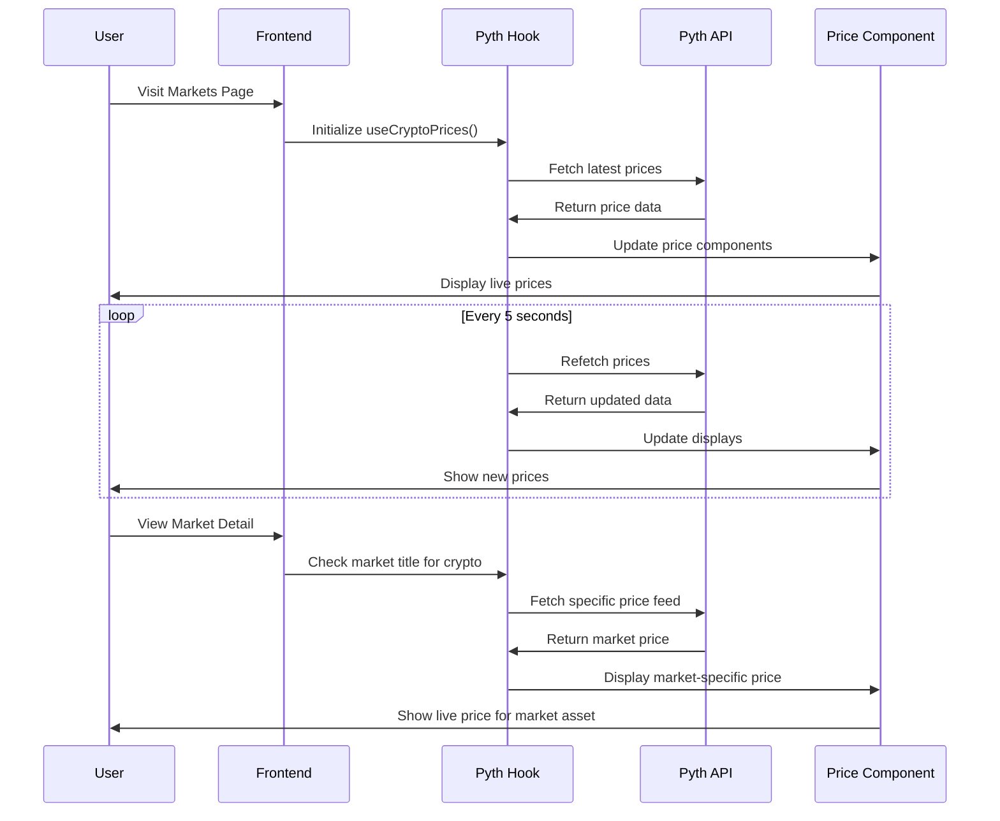

## 13. Push UI Kit Integration Summary

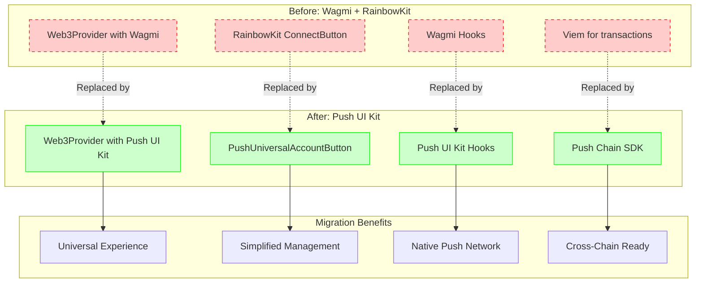

---

*These diagrams provide a comprehensive overview of the PushPredict universal cross-chain prediction market architecture, now fully integrated with Push UI Kit for seamless wallet management and native Push Network support. The migration from Wagmi/RainbowKit to Push UI Kit enables better user experience with universal account creation, cross-chain compatibility, and simplified wallet management.*