# PushPredict Architecture Diagrams

This document contains Mermaid diagrams that visualize the architecture and flows of the PushPredict universal cross-chain prediction market platform.

## 1. System Architecture Overview

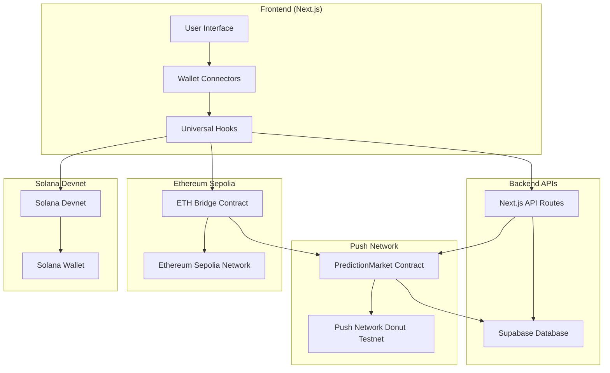

## 2. Universal Cross-Chain Betting Flow

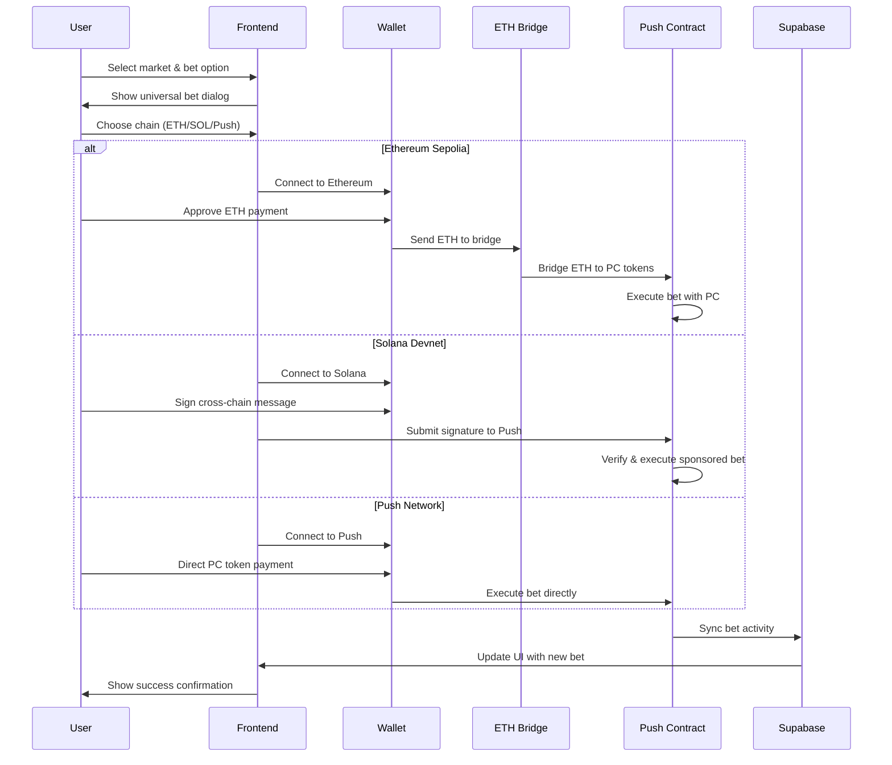

## 3. ETH Bridge Architecture

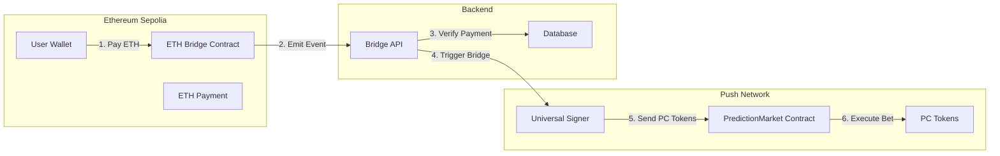

## 4. Database Schema Relationships

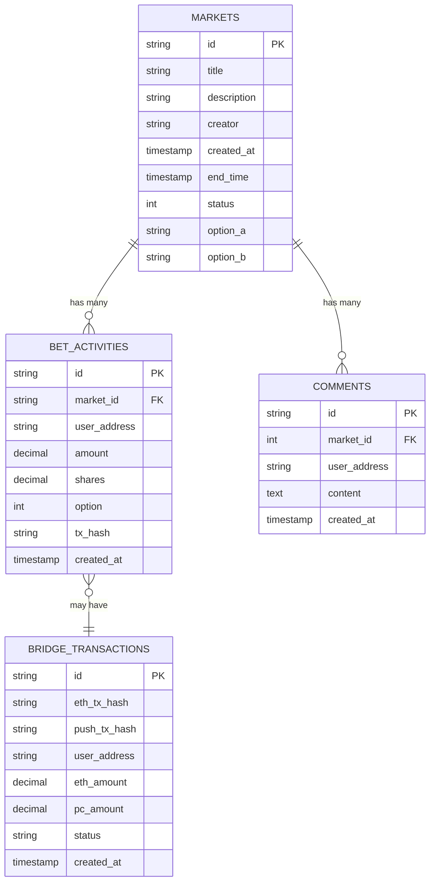

## 5. Universal Wallet Connection Flow

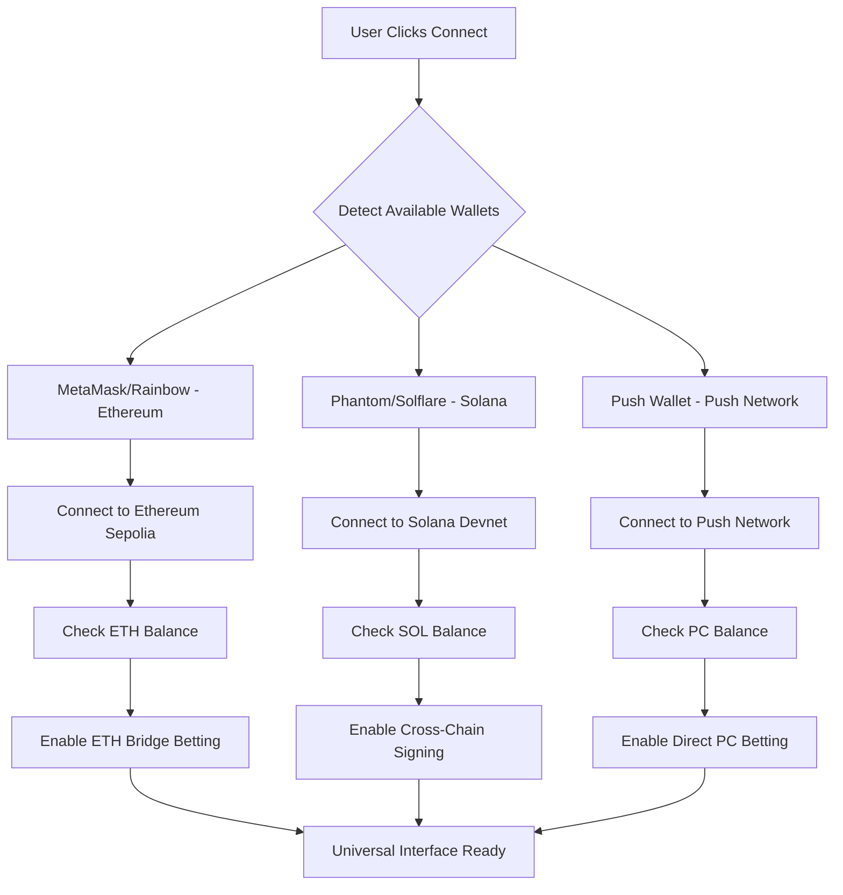

## 6. Market Resolution Process

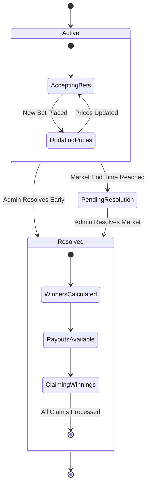

## 7. Cross-Chain Transaction Verification

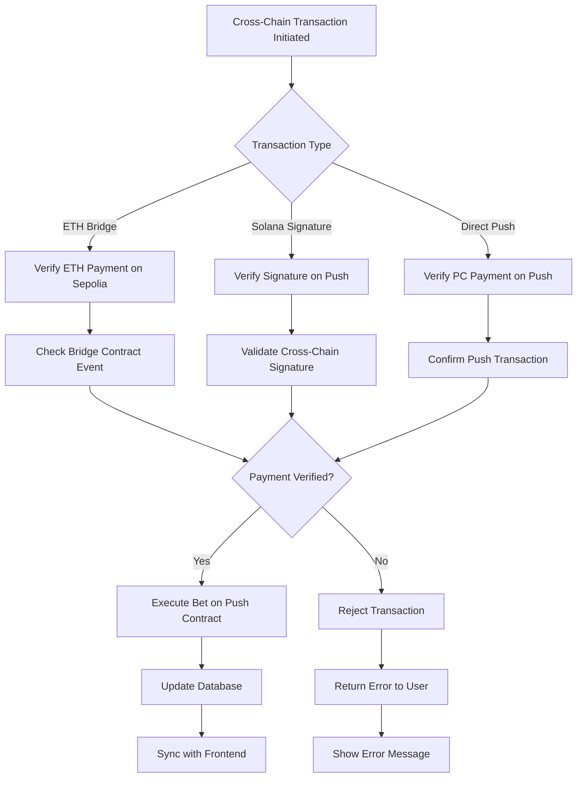

## 8. Universal Hook System Architecture

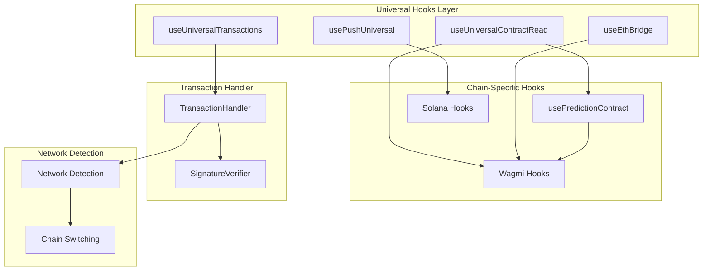

## 9. Real-Time Data Synchronization

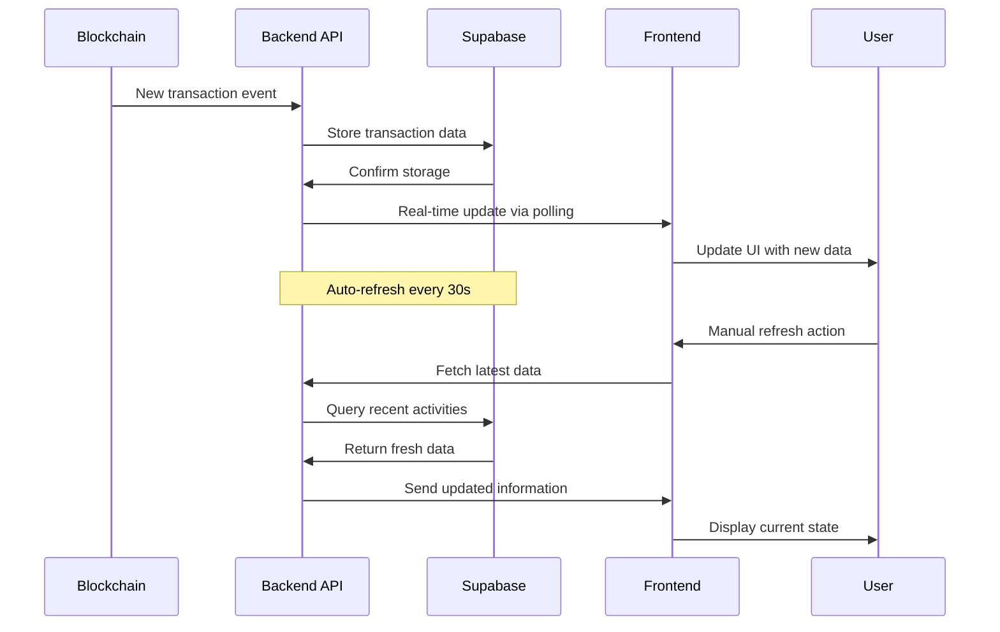

## 10. Security & Verification Flow

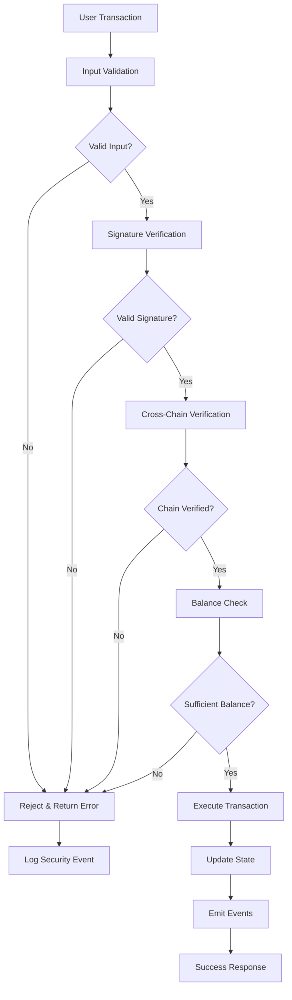

## 11. Pyth Network Price Feed Integration

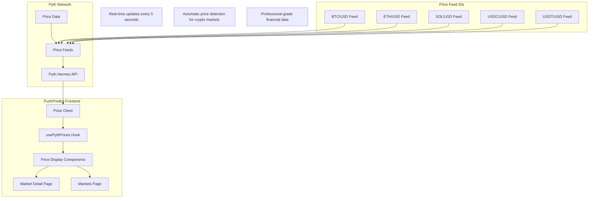

## 12. Live Price Display Flow

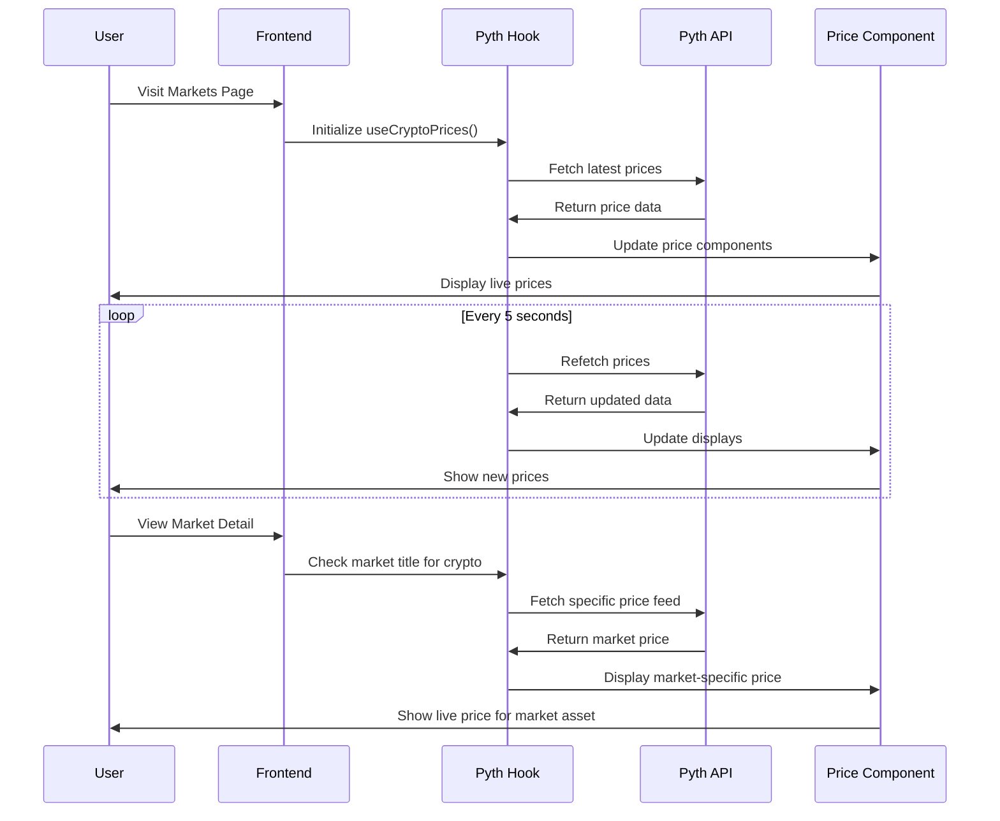

---

*These diagrams provide a comprehensive overview of the PushPredict universal cross-chain prediction market architecture, including Pyth Network integration for real-time price feeds, showing how different components interact to enable seamless betting across Ethereum Sepolia, Solana Devnet, and Push Network.*